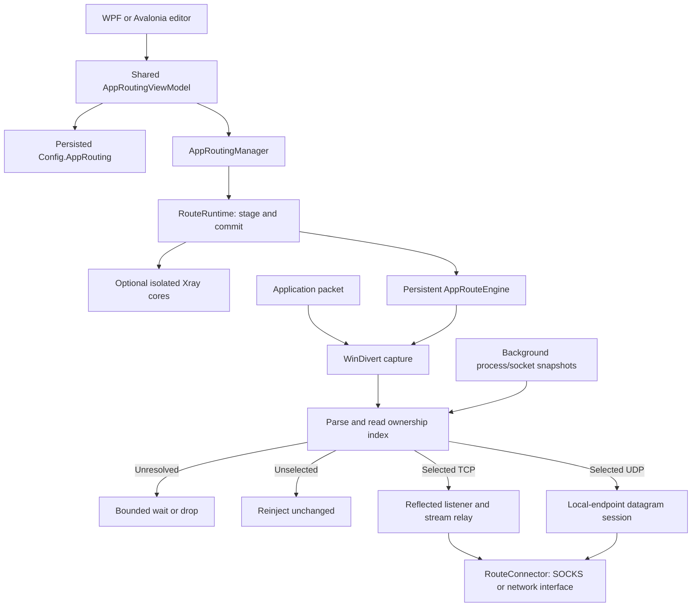

# Application routing: code walkthrough for reviewers

This guide explains the Windows application-routing implementation, its ownership
boundaries, and the reasoning behind the less obvious code. It describes the
current source, including behavior that still needs native integration testing.
For user instructions, build commands, supported destinations, and the runtime
validation matrix, see [Application routing for Windows](application-routing.md).

Application routing selects an outbound for an executable without requiring that
executable to support proxies. WinDivert supplies outbound IP packets; Windows
socket tables identify their owners. Selected TCP connections are reflected into
local TCP listeners and relayed as streams. Selected UDP datagrams are sent
through relay sockets shared by each process/local endpoint/rule. Both paths
preserve the remote address and port that the application expects to see.

## Suggested reading order

All source links are relative to this document so they work in a repository
browser. Method names are used instead of line numbers to keep the guide useful
as the implementation changes.

| Read | Files | Main review question |
| --- | --- | --- |
| 1 | [AppRoutingItem.cs](../v2rayN/ServiceLib/Models/Configs/AppRoutingItem.cs), [AppRoutingLifecycle.cs](../v2rayN/ServiceLib/Services/AppRouting/AppRoutingLifecycle.cs) | What is persisted, and what happens on start, stop, and failure? |
| 2 | [AppRoutingViewModel.cs](../v2rayN/ServiceLib/ViewModels/AppRoutingViewModel.cs) | When do draft edits become saved rules and running routes? |
| 3 | [AppRoutingManager.cs](../v2rayN/ServiceLib/Manager/AppRoutingManager.cs), [RouteRuntime.cs](../v2rayN/ServiceLib/Services/AppRouting/RouteRuntime.cs), [RouteProfileInstance.cs](../v2rayN/ServiceLib/Services/AppRouting/RouteProfileInstance.cs), [AppRouteProfileConfig.cs](../v2rayN/ServiceLib/Services/AppRouting/AppRouteProfileConfig.cs) | Who prepares, commits, supervises and retires runtime resources? |
| 4 | [RouteAttribution.cs](../v2rayN/ServiceLib/Services/AppRouting/RouteAttribution.cs), [AppRouteMatcher.cs](../v2rayN/ServiceLib/Services/AppRouting/AppRouteMatcher.cs), [RouteOwnerTable.cs](../v2rayN/ServiceLib/Services/AppRouting/RouteOwnerTable.cs), [RouteProcessTree.cs](../v2rayN/ServiceLib/Services/AppRouting/RouteProcessTree.cs) | How does a packet acquire an executable rule? |
| 5 | [AppRouteEngine.cs](../v2rayN/ServiceLib/Services/AppRouting/AppRouteEngine.cs), [RouteNatTable.cs](../v2rayN/ServiceLib/Services/AppRouting/RouteNatTable.cs) | How do TCP reflection, connection reuse, and shutdown work? |
| 6 | [RouteUdpSession.cs](../v2rayN/ServiceLib/Services/AppRouting/RouteUdpSession.cs), [RouteConnector.cs](../v2rayN/ServiceLib/Services/AppRouting/RouteConnector.cs) | How are UDP ownership, SOCKS negotiation, and adapter binding handled? |
| 7 | [RoutePacket.cs](../v2rayN/ServiceLib/Services/AppRouting/RoutePacket.cs), [RouteFragmentBuffer.cs](../v2rayN/ServiceLib/Services/AppRouting/RouteFragmentBuffer.cs), [WinDivertApi.cs](../v2rayN/ServiceLib/Services/AppRouting/WinDivertApi.cs) | Which packet and native-layout assumptions require care? |
| 8 | [AppRouting tests](../v2rayN/ServiceLib.Tests/AppRouting) | Which behaviors have deterministic coverage, and which require a dedicated Windows host? |

## 1. Architecture and responsibilities

The main separation is between configuration, resource ownership, and packet
handling. The editor does not own interception. Closing its window disposes its
bindings and commands; the singleton manager continues running the routes.



`AppRoutingManager` serializes runtime changes, prepares saved-profile endpoints,
and supervises a `RouteRuntime`. That runtime owns the exclusive capture lease,
engine, and individually owned Xray instances. Each `RouteProfileInstance` owns
its process, job, generated file, and authenticated listener endpoint.
`AppRouteEngine` owns the capture handle, local TCP listeners, connection/session
tables, and the background attribution source. `RouteConnector` establishes an
outbound, but does not select a rule or modify persisted configuration.

`IAppRoutingRuntime` exposes only `IsEnabled`, `StartAsync`, and `StopAsync` to
the editor and lifecycle helper. Tests replace this boundary to exercise state
transitions without starting a driver or a core.

## 2. Persisted model and executable matching

`Config.AppRouting` contains the global `Enabled` preference and a list of
`AppRouteRule` objects. A rule has a stable ID, its own enabled flag, an executable
match, optional child matching, and destination-specific fields. SOCKS passwords
are ordinary configuration values; masking the editor field does not encrypt
the configuration file.

The persisted enum values deliberately differ from the visual option order:

| Value | Meaning |
| --- | --- |
| `0` | Saved profile |
| `1` | Explicit SOCKS5 endpoint |
| `2` | Network interface |
| `3` | Active profile |

The editor explicitly chooses `ActiveProfile` for a new rule. Moving this option
to the top of the UI must not renumber older saved destinations. Missing global
enabled/child/blocking settings deserialize to `false`; new rules are enabled.

`AppRouteMatcher.Normalize` trims outer whitespace and one surrounding pair of
quotes. It never splits on spaces. Full-path mode requires a fully qualified
`.exe` path and normalizes it with `Path.GetFullPath`. Name mode extracts the
filename even when the input came from a full path. It also requires `.exe`.
Neither mode requires the file to exist, so uninstalling an application or moving
its versioned directory does not invalidate unrelated routing rules.

The matcher maintains separate case-insensitive path and filename dictionaries.
An exact-path rule wins over a name rule regardless of list order. Validation
allows both to coexist but permits only one enabled rule for the same normalized
match and mode. Disabled duplicates are therefore valid until someone tries to
enable a conflicting rule. Validation also rejects known v2rayN/core executable
names and invalid destination/credential fields.

This is executable matching, not package identity, publisher verification, or
filesystem identity: a name rule applies to every executable with that name,
and full-path matching does not resolve file IDs or aliases.

## 3. Editor, persistence, and runtime state

Three states must remain distinct:

| State | Owner | Meaning |
| --- | --- | --- |
| Form fields | `AppRoutingViewModel` | An unfinished draft; selecting a row copies values into the form. |
| Saved rules and enabled preference | `Config.AppRouting` | The user's configuration, including what should start on the next launch. |
| Actual engine state | `AppRoutingManager.IsEnabled` | The manager has committed a running runtime; asynchronous failure supervision updates it. |

The switch displays the saved preference. `SyncSwitch` suppresses the reactive
callback while restoring that value, so reading state does not trigger another
start/stop command. `CanChangeRouting` combines administrator rights with the
busy state. A non-administrator can edit rules but cannot operate the switch;
its saved on/off value remains visible.

`SaveAndApply` validates a prospective list, replaces the configuration with a
deep copy, and saves it before committing visible rows. A save failure restores
the previous configuration and leaves the draft intact. A runtime failure after
a successful save retains the saved edits and reports the failure. These are
different outcomes: failing to apply a valid saved change must not silently
discard the user's work.

Table checkboxes call `ToggleRuleFlag`, which copies the stored row and changes
only the requested flag. They do not save unrelated edits still in the form.
The corresponding selected-form flag is synchronized after a successful save.
Deleting or disabling the last enabled rule also clears the global enabled
preference when running as administrator. Non-administrator edits preserve that
preference and do not invoke the runtime.

`AppRoutingLifecycle` handles explicit global toggles and startup separately:

| Event | Persistence and runtime behavior |
| --- | --- |
| Manual enable/disable | Save the new preference, then start/stop. Restore and save the previous preference if the runtime operation fails. A preference rollback does not itself recreate a previous engine. |
| Application startup | `RestoreAsync` starts routing if the preference is enabled and the runtime is inactive. A startup failure leaves the enabled preference intact. |
| Save/delete/toggle a rule while globally enabled | Save first, then reapply, or stop if no active rules remain; administrator rights are required for the runtime step. |
| Close the editor | Dispose editor subscriptions/commands; leave the manager running. |
| Exit v2rayN | Shut down feature resources without clearing the startup preference. |

The existing application's integration points are small:

- [MainWindowViewModel.cs](../v2rayN/ServiceLib/ViewModels/MainWindowViewModel.cs)
  opens the editor, restores routing after normal startup reload, and checks
  whether effective saved-profile configurations changed during a main-core reload.
- [AppManager.cs](../v2rayN/ServiceLib/Manager/AppManager.cs) calls
  `ShutdownAsync` before the normal main core stops.
- [StatusBarViewModel.cs](../v2rayN/ServiceLib/ViewModels/StatusBarViewModel.cs)
  refuses to enable TUN while application routing is starting or owns an engine.
  The manager also refuses to start application routing while TUN is enabled.

### UI-specific responsibilities and the app picker

The [WPF window](../v2rayN/v2rayN/Views/AppRoutingWindow.xaml) and
[Avalonia window](../v2rayN/v2rayN.Desktop/Views/AppRoutingWindow.axaml) bind to the
same view model. Their code-behind supplies platform file dialogs and owned modal
picker windows. WPF additionally bridges its password control to the view model.
There is no separate routing implementation in either UI.

`PickProcess` returns a selected `AppRouteProcess`, or `null` on cancellation.
The editor changes only after acceptance. The separate picker shares the view
model's search/snapshot state and refreshes on opening.
[AppRouteProcessCatalog.cs](../v2rayN/ServiceLib/Services/AppRouting/AppRouteProcessCatalog.cs)
reads IPv4/IPv6 TCP and UDP owner tables, groups rows by PID, and resolves the
executable image path. Its counts are TCP table entries and UDP endpoints,
including listeners; they are not traffic-rate measurements. It formats these
as `TCP/UDP` and appends the PID to the name in parentheses.

The picker excludes PID 4 and lower, protected core names, and known paths under
the actual Windows `System32`/`SysWOW64` directories. The directory comparison
includes a separator so similarly prefixed directories are not hidden. If a path
is inaccessible, it can fall back to an executable name. This display filter is
separate from manual rule validation and runtime matching.

## 4. Runtime ownership and destination preparation

`AppRoutingManager.StartAsync` validates the saved preference, Windows architecture,
administrator token, TUN conflict, native files and enabled rules. A semaphore
serializes lifecycle operations. It snapshots configuration inside that boundary;
runtime transformation never changes the saved profile selection or credentials.

[RouteRuntime.cs](../v2rayN/ServiceLib/Services/AppRouting/RouteRuntime.cs) separates
preparation from commitment. Initial startup acquires a machine-wide
[RouteCaptureLease](../v2rayN/ServiceLib/Services/AppRouting/RouteCaptureLease.cs)
before starting cores or interception. The named `Global\v2rayN.ApplicationRouting`
event is retained as an ownership token, not signalled. An existing token rejects
a second owner. Unlike a mutex, releasing this token is not thread-affine, which
matters across `await`. Process exit releases the handle. This coordinates copies
implementing this feature; it cannot coordinate arbitrary third-party filters.

The replacement sequence is:

1. Build effective profile plans and reuse live cores with identical fingerprints.
2. Start new cores and authenticate their SOCKS listeners while the old engine,
   old cores, and old rules continue serving traffic.
3. Create runtime rule copies pointing to the prepared endpoints. Prepare an
   ownership index for that policy outside the packet lock.
4. Commit the policy under the engine's packet lock. Keep unchanged TCP mappings
   and UDP sessions; cancel only those whose rule changed or disappeared.
5. Publish resource ownership and retire superseded cores after their routes
   have been detached. The capture handle and TCP listeners remain in place.

Preparation failure disposes only newly created resources and preserves the old
runtime. On initial failure it also releases the new capture lease. The engine's
`ApplyAsync` contract permits cancellation/failure before commitment. Once it
returns successfully, the runtime owns the committed resources even if cancellation
arrives immediately afterward; `StopAsync` drains them normally. Rechecking the
token after commitment would incorrectly dispose a core now used by live rules.

Stop cancels an outstanding preparation before waiting for the lifecycle semaphore.
Shutdown sets its flag before stopping, so delayed startup cannot outlive exit.
An unsuccessful apply retains saved edits as well as the previous live policy;
the normal error notification tells the user that the new settings did not apply.

| Destination | Runtime endpoint | Relation to main routing rules |
| --- | --- | --- |
| Active profile | Current main loopback SOCKS port, resolved for each new connection/association. | Uses the main core's routing and UDP policy. |
| Saved profile | Prepared authenticated Xray SOCKS listener; only the runtime rule becomes SOCKS. | Uses the selected generated outbound/chain, optionally preceded by copied block rules. |
| Explicit SOCKS5 | Supplied endpoint and optional credentials. | The selected SOCKS server decides subsequent routing. |
| Network interface | Socket pinned to the selected adapter. | Does not enter the main proxy's routing engine. |

### Isolated saved-profile cores

`PreparePlan` copies the saved profile and configuration, requests Xray through
the existing `CoreConfigContextBuilder`, and disables TUN in the copy. Custom full
configurations remain unsupported. The generated template uses fixed placeholder
listener credentials/port. A SHA-256 fingerprint covers this effective template,
the resolved core path, and sorted core environment settings. Profile, transport,
chain/balancer, DNS and applicable blocking changes therefore invalidate the plan
without maintaining a separate list of every dependency property. Identical
effective plans share a core, including across reloads.

[RouteProfileInstance.cs](../v2rayN/ServiceLib/Services/AppRouting/RouteProfileInstance.cs)
substitutes an ephemeral loopback port and random password, writes a unique config,
starts a `ProcessService`, and assigns it to its own kill-on-close
[WindowsJobService](../v2rayN/ServiceLib/Services/WindowsJobService.cs). Each core has
independent ownership, so retiring one cannot kill reused cores. Readiness uses
an authenticated SOCKS greeting within ten seconds. Refusal is retried; process
exit, invalid authentication and timeout fail preparation. The port reservation
must be released before Xray binds; a conflict remains a reported startup failure.

The process exit task is exposed for supervision. Cleanup stops the owned process,
closes its job, observes exit, disposes process resources and deletes its config.
Runtime credentials never replace the user's saved profile choice.

### Optional blocking rules

`AppRouteProfileConfig.GetBlockingRouting` creates a snapshot containing only
enabled, non-DNS rules whose outbound tag is `block`, plus the effective domain
strategy. It preserves their relative order and other conditions. Direct/proxy
rules do not enter this snapshot, even if they preceded a block rule originally.

`Generate` uses the existing Xray configuration generator, adds an authenticated
loopback SOCKS inbound with UDP enabled, and allows UDP port 443 through the
generated XUDP policy. When blocking is enabled, the inbound is tagged `socks`
and enables HTTP/TLS/QUIC sniffing with `routeOnly = true`. Sniffed names can
participate in routing while the original destination IP remains the target.
Hidden names and conditions requiring the original process remain limited by
what Xray can observe through the SOCKS relay.

The shared generator change is in
[CoreConfigV2rayService.cs](../v2rayN/ServiceLib/Services/CoreConfig/V2ray/CoreConfigV2rayService.cs):
`GenerateClientSpeedtestConfig` delegates to `GenerateClientSocksConfig` with
routing disabled, preserving that existing path. Application routing can enable
context rules before the generated final outbound/balancer rule. Outbound and
chain generation stay in the existing implementation.

The accompanying
[V2rayRoutingService.cs](../v2rayN/ServiceLib/Services/CoreConfig/V2ray/V2rayRoutingService.cs)
change filters commented domains before adding the generated domain rule. It
avoids indexing a list after removing its last element and avoids emitting an
empty domain branch that would lose the original restriction.

Normal core reload regenerates effective profile plans, including for saved
profiles without blocking enabled. Only changed plans replace their cores.
Unrelated rules absent from the generated configuration do not invalidate a core.
Active-profile and explicit SOCKS/NIC routes do not acquire isolated Xray cores.
Changed routes need new application connections; unchanged routes are retained.

## 5. Attribution and child-process inheritance

WinDivert NETWORK packets do not contain a PID. `RouteFlow` records protocol,
local and remote addresses/ports, including scope for IPv6 link-local addresses.
[RouteOwnerTable.cs](../v2rayN/ServiceLib/Services/AppRouting/RouteOwnerTable.cs)
only reads/parses native TCP/UDP tables. Its former per-lookup cache and linear
matcher are removed. Buffer sizing retries are bounded to four attempts if
concurrent socket creation changes the table between calls.

[RouteAttribution.cs](../v2rayN/ServiceLib/Services/AppRouting/RouteAttribution.cs)
separates native sampling from packet handling. `RouteAttributionSource` reads
process identities and both IP families' owner tables on a background worker.
It computes each process's rule once per snapshot and builds immutable indexes:
TCP by full tuple, UDP by local endpoint with exact/wildcard ownership merged.
Packet lookups do no native calls, process-handle opens, or owner-table scans.
Known unselected flows are indexed too; their traffic does not repeatedly resolve
the same executable. Snapshots normally refresh after 100 ms and wake sooner for
new unresolved flows, with at least 25 ms between completed refreshes to coalesce
bursts. The index is atomically replaced only if its policy is still current.

The four outcomes are deliberately distinct:

| Decision | Packet behavior |
| --- | --- |
| Selected | Use the associated process identity and rule. |
| Unselected | Reinject the original packet/fragments unchanged. |
| Unresolved | Wait for attribution in a bounded queue; never interpret missing identity as a proven non-match. |
| Ambiguous | Drop and report when shared ownership could include selected traffic. |

Missing processes, inaccessible paths that could match a full-path rule, missing
socket rows and snapshots older than 500 ms are unresolved. A new TCP SYN requires
a sample begun at or after its arrival, protecting reconnects against an older
tuple owner. Unknown packets retain their original arrival time across retries.
[RoutePendingPackets](../v2rayN/ServiceLib/Services/AppRouting/RoutePendingPackets.cs)
allows 512 packets and 4 MiB, counting retained fragments, for at most 250 ms
before a retry drops the packet and emits a throttled notice. Under load or with
inaccessible ownership this can also drop traffic that would otherwise prove
unselected. No direct fallback is used to hide that failure.

### Process identities and ancestry

[RouteProcessSnapshot](../v2rayN/ServiceLib/Services/AppRouting/RouteProcessSnapshot.cs)
retains read-only process handles, creation times and observed exit times. It
rechecks exits after enumeration and rejects a process started after the sample
time as a potentially reused PID. `RouteProcessTree` retains this history across
policy changes; only its matcher and exclusions change. A rule update therefore
does not discard ancestry already learned for children of an exited parent.

The graph links a child to the newest observed parent generation whose lifetime
contains the child's creation time. Own rules take precedence; otherwise the
nearest ancestor with child matching supplies the rule. Traversal continues to
check excluded/protected ancestors, even after finding a match. A visited-key set
rejects cyclic ancestry. Without any child rules, direct matching skips traversal.
Live ancestry and up to 2048 recent exited records plus their ancestry are retained.

The engine PID and its core PIDs are excluded. Known core executable names are
also protected. Unobserved or inaccessible ancestry still cannot be reconstructed
reliably: short-lived launchers and broker-mediated launches may need explicit
child rules. This is Windows parentage, not package membership.

Process and socket tables are separate samples, not atomic kernel socket identity.
Closure/rebind between samples, including within one process, still requires
native stress testing. This implementation improves bounded attribution and cost
without adding a second interception layer; it does not claim firewall isolation.

## 6. TCP: packet reflection followed by stream relay

`AppRouteEngine.Start` creates a listener for each available IP family, with
IPv6 dual mode disabled so each listener has an unambiguous family. Listeners
bind wildcard local addresses on ephemeral ports. The capture filter is:

```text
outbound and !loopback and (tcp or udp or fragment)
```

Capture uses the NETWORK layer at priority 100. The fragment term includes
non-initial fragments without TCP/UDP headers. A dedicated long-running worker
performs blocking receive; accept loops and relay I/O are asynchronous.

### A concrete connection

Let `L:a` be the application's local endpoint and `R:b` its intended remote
endpoint. Let `p` be the engine listener port and `t` the translated port reserved
for this flow. The following endpoint transformations happen inside Windows:

```text
Application packet:             L:a  -> R:b
Reflected packet, injected in:   R:t  -> L:p
Local listener response:         L:p  -> R:t
Restored response, injected in:  R:b  -> L:a
```

The reflected connection lets the normal Windows TCP stack supply a stream to
the relay. The engine does not implement TCP sequence acknowledgment, congestion
control, or stream reassembly itself. The relay establishes a separate outbound
socket to the original destination through SOCKS or the selected adapter. TLS
bytes are copied without TLS termination.

`Process` checks for listener response packets first. Their translated endpoint
must have a matching reverse NAT entry; otherwise they are dropped so synthetic
responses cannot escape onto the physical network. The rewrite restores the
original interface metadata, changes direction to inbound, and recalculates
checksums before reinjection.

For an ordinary TCP packet, the engine looks up the original flow. If no mapping
exists, it identifies the owner. Unselected traffic is reinjected unchanged. A
selected flow can create a mapping only from a SYN without ACK. Remaining packets
of a connection established before interception are dropped rather than sent
directly; the application must reconnect.

### NAT identity and reconnects

`RouteNatTable` has a forward dictionary keyed by the complete original flow and
a reverse dictionary keyed by a separately allocated translated port. Reverse
lookup also verifies both addresses. This prevents connections sharing only a
local source port from collapsing into one reflected stream.

A SYN with the same initial sequence number retains an existing mapping as a
retransmission. A SYN for a closed mapping, or with a different initial sequence
number, retires the old forward entry and creates a fresh route decision. The
old reverse entry remains temporarily to contain late responses. Cleanup removes
closed or never-accepted entries after 120 seconds without activity; active
accepted streams are not expired by this timer. Translated ports come from
1024–65535 and are not reused while still present in the reverse table.

`Accept` rejects unknown, retired, or already accepted entries and enforces the
active TCP relay limit. It disposes an accepted socket unless ownership has
transferred to `Relay`. Connection-reset/aborted accept failures are recoverable
inside the loop; other unexpected failures stop the engine.

`Relay` applies a 15-second connection/handshake deadline and disables that
deadline after connection. Two copy tasks carry the stream in opposite
directions. EOF shuts down the destination socket's send half, allowing the
opposite direction to finish. A copy failure disposes both sockets to unblock
the other copy. Completion marks the NAT entry closed and updates its timestamp.
The NAT entry owns a relay cancellation source: policy retirement cancels setup
or stream copying, while keeping the reverse mapping for late responses. The
retirement timestamp begins the late-response retention interval.

## 7. UDP: session ownership, buffering, and replies

UDP does not use TCP reflection. The engine keys `RouteUdpSession` by process
identity (PID plus creation time), original local address/port, and rule ID.
The remote peer is deliberately absent: an application's local UDP endpoint can
send to multiple destinations through one outbound socket/SOCKS association.
This preserves a stable outbound source port for that session and accepts replies
from a different peer, as an unconnected application socket may require.

This is an observed local endpoint, not a Windows socket ID. A wildcard socket
using several source addresses or both IP families can still have several sessions.
Same-process close/rebind between ownership samples cannot always be detected.
These limits must not be presented as exact socket lifetime tracking.

`RouteFlowOwner` checks the current immutable ownership index before queueing,
sending and delivering replies. There is no second timed cache. Once ownership
is lost the session stays invalid, protecting delayed handshakes, queued packets
and late replies from an observed owner change or PID reuse.

For SOCKS routes, `Run` opens a control connection, binds a UDP socket on that
connection's local address, requests UDP ASSOCIATE and connects the socket to the
returned relay. Receive, queued send and control-channel monitoring run together;
completion/failure of one cancels and drains the others. The control connection
remains open throughout the association. Each queued datagram carries its own
destination; valid reply framing supplies the actual peer address/port. Literal
source addresses must match the session's destination family.

NIC routes use an unconnected socket bound to the selected adapter, with
`SendToAsync`/`ReceiveFromAsync` for multiple peers. Link-local destinations use
that adapter's scope. `CreateUdpReply` constructs an inbound packet from the actual
replying peer to the application's original local endpoint. WinDivert calculates
checksums and reinjects it with the captured interface metadata; Windows applies
the application's own connected/unconnected receive semantics.

Engine packet processing serializes producers. `Send` copies accepted payloads
into a channel limited to 64 datagrams and 64 KiB. `TryWrite` never waits; byte
budget rejection happens before allocation. Dequeue, failed enqueue and completion
release their byte reservations. In-flight/framing/receive buffers are outside
that queue budget. Session setup is limited to 15 seconds and idle time to 60
seconds. A failed association can be replaced by the next packet.

Cleanup removes the exact dictionary key/value it inspected so it cannot remove
a replacement installed concurrently. A separate task registry retains all live
session tasks, including removed/replaced sessions, until completion. Shutdown
must drain these retiring sessions too, not only the current endpoint dictionary.

## 8. SOCKS and network-interface details

`RouteConnector` uses `ReadExactlyAsync` for protocol fields, so split TCP reads
are handled correctly. It validates method selection, optional username/password
authentication, command status, address type, and reply lengths. Credentials
are limited by UTF-8 byte length rather than character count.

Active-profile connections use the main local listener and ignore any old
explicit SOCKS credentials on the rule. Other SOCKS connections use the supplied
endpoint. CONNECT sends an IP destination and consumes the complete bind reply;
it does not resolve a returned domain unnecessarily. UDP ASSOCIATE needs the bind
endpoint, so a domain is resolved when the UDP socket connects. Unspecified bind
addresses use the proxy peer address; IPv4-mapped addresses are normalized.

SOCKS UDP fragmentation (`FRAG != 0`) is unsupported. UDP reply framing accepts
literal IPv4/IPv6 source addresses, not domain-form source addresses. This is
separate from supporting a domain-form UDP relay address in the control reply.
There is no silent direct fallback after a SOCKS failure.

For an interface route, `CreateInterfaceSocket` resolves the stored adapter ID
again when creating a socket. The adapter must be up and have a suitable unicast
address for the destination family. It sets socket option 31 at the appropriate
IP level (`IP_UNICAST_IF`/`IPV6_UNICAST_IF`) and binds the chosen source address.
The IPv4 index is passed in network byte order; the IPv6 index is not converted.
Link-local IPv6 destinations use the selected adapter's scope. If setup fails,
the socket is disposed and the error propagates; the default adapter is not
substituted. There is no address-selection UI or automatic migration of existing
sockets when an adapter changes.

## 9. Packet parsing and IP fragments

`RoutePacket.Parse` validates IP/transport bounds and supported IPv6 extension
headers, then returns the flow and byte offsets used for rewriting. WinDivert
calculates checksums before injection. A null parse result passes through;
unsupported/raw protocols are outside application routing, not a universal
malformed-packet blocking policy.

`RouteFragmentBuffer` keys fragments by source, destination, ID, protocol and
interface. A first TCP/UDP fragment containing transport ports can be classified
before complete assembly. If proven unselected, any earlier buffered parts and
the first fragment are reinjected unchanged. A bounded 4096-entry, 15-second
bypass table passes later parts through. A new first fragment rechecks ownership;
policy changes clear bypass decisions. Unsupported protocols skip reassembly.

There are two important exceptions to early bypass. Fragmented TCP SYNs (or tiny
first fragments without TCP flags) must reach normal fresh ownership checking.
Reflected listener responses and existing selected TCP mappings must reach NAT,
even though the listener's process is normally excluded. Letting those fragments
take the ordinary unselected path would emit synthetic traffic on the network.

Selected and unresolved fragments use bounded reassembly: 256 assemblies, 1024
parts each, 16 MiB of accounted original/payload data, and a 15-second age limit.
Exact duplicates are ignored; overlap or inconsistent ranges reject an assembly.
Completion reconstructs one packet, removing the IPv6 fragment header when needed.
Original fragments are retained for unchanged pass-through if completed attribution
is unselected. Out-of-order parts without their first fragment still wait and can
hit assembly limits. Expiry runs on subsequent fragmented input; memory is bounded
even if no further input arrives.

## 10. Concurrency, health, limits, and shutdown

| Shared state | Synchronization and ownership |
| --- | --- |
| Runtime plans, core instances, generation, lease | Manager semaphore around `RouteRuntime` operations. |
| Policy commit, capture packet processing, pending retries, fragment state | `_packetGate`; native sampling and awaited setup occur outside it. |
| Process handles and ancestry | `RouteAttributionSource` lock, used only by preparation/refresh. |
| Immutable ownership index | Atomic publication/read; no lookup lock or native work. |
| WinDivert send/shutdown/close | `_sendGate`; blocking receive is outside the lock. |
| NAT dictionaries | Short NAT lock; each entry separately owns relay cancellation. |
| Relay/session lookup and task registries | Concurrent dictionaries with exact-entry removal. |
| UDP ownership validity | Sticky invalidation under `RouteFlowOwner` lock; its callback only reads the immutable index. |
| Shared timestamps and NAT flags | Interlocked long accesses and volatile flags, including x86. |

The UDP ownership callback never takes the packet lock: send/receive workers can
invoke it while packet processing holds the packet lock and checks session
ownership. Taking both locks in opposite order would deadlock.

Other limits are 2048 active TCP relays and 2048 active UDP endpoint sessions,
15-second outbound setup, ten-second core readiness and 120-second retention of
closed/unaccepted TCP mappings. Cleanup runs every ten seconds. Retiring tasks
are separately drained and may briefly exceed the active-session count.

Per-flow errors use a throttled notice and never silently send selected packets
directly. Fatal capture/listener/maintenance/attribution errors complete the engine's
failure task and stop its workers. Capture closes the handle in `finally`, avoiding
an unserviced interceptor blocking the host indefinitely.

The manager exposes `Stopped`, `Starting`, `Running`, `Stopping` and `Faulted`.
It watches engine completion and every active isolated core's exit task. An
unexpected exit takes the lifecycle semaphore, verifies the watched generation,
drains the runtime, releases the lease, marks faulted and reports through normal
v2rayN notifications. There is no automatic restart loop. Superseded observers
are cancelled and generation-checked; intentional retirement cannot stop the new
runtime. The persisted enabled preference remains intact for the next launch.
`IsRunning` includes startup/resource ownership for the TUN exclusion check;
`IsEnabled` reflects the manager's committed running state.

Stop cancels preparation, cancels the current observer and drains the engine
before retiring cores. Engine disposal stops producers and awaits worker tasks
before snapshotting remaining TCP and UDP tasks: a final accept/capture iteration
can otherwise register a task after disposal's initial snapshot. Only after those
tasks complete are native/process handles and cancellation resources released.
Core jobs, processes, files and the capture lease are owned by this feature;
the main core and any separate running installation are outside its ownership.

## 11. Native boundary and architecture support

`WinDivertApi` is the only interception P/Invoke surface. `DivertAddress` has an
explicit 80-byte layout: a 16-byte header and a 64-byte union. Although the
NETWORK member used here is only eight bytes, shrinking the managed structure
to that member would corrupt native reads/writes. The bindings use Cdecl,
pointer-sized handles, and Win32 boolean marshaling.

Runtime support checks require both process and OS architecture to be x86/x64
Windows. An x86 process under WOW64 uses an x86 DLL with an x64 kernel driver.
`RouteProcessSnapshot.ProcessEntry` uses pointer-sized fields for the Toolhelp
layout; owner-table rows are parsed from their fixed native byte layouts.

[Get-WinDivert.ps1](../scripts/Get-WinDivert.ps1) downloads the pinned archive,
checks its digest and driver signatures, and prepares ignored native assets.
[Directory.Build.targets](../v2rayN/Directory.Build.targets) copies the matching
DLL, driver files, and license into the two Windows GUI publishes outside their
single-file executables. x64 packages include `WinDivert64.sys`; x86 packages
include both driver architectures. The download/build steps do not open a
driver. Xray and routing data still come from normal core/release packaging.

Starting interception requires a Windows administrator token. There is no
separate elevated service, automatic UAC launch, or per-user interception broker.
The ordinary build and managed tests do not require Windows administrator rights.
Any execution restrictions imposed by a developer's build environment are
separate from this runtime requirement.

## 12. Review and validation map

The tests in [ServiceLib.Tests/AppRouting](../v2rayN/ServiceLib.Tests/AppRouting)
cover these boundaries:

| Test file | Behaviors to inspect |
| --- | --- |
| `LifecycleTests.cs` | Persistence, startup restoration, explicit disable, save failures, and failed manual enable. |
| `RuleEditorTests.cs` | Spaced/quoted paths, name/path precedence, old destination values, draft preservation, row flags, picker filtering, and non-administrator behavior. |
| `ProfileConfigTests.cs` | Isolated authenticated UDP listener, copied block rules, commented domains, effective template invalidation, snapshots, and final profile/balancer preservation. |
| `ProcessTreeTests.cs` | Own/ancestor precedence, exited parents, recycled PIDs, excluded subtrees, and native read-only process timing. |
| `OwnerTableTests.cs` | Real dual-stack TCP/UDP owner tables parsed into the production index. |
| `AttributionTests.cs` | Indexed lookup cost, ownership changes, bounded deferral, selective TCP retirement and native socket closure. |
| `RuntimeTests.cs` | Staging/reuse, rollback, cancellation at commitment, failure observation and exclusive capture ownership. |
| `PacketTests.cs` | Native address layout, IPv4/IPv6 bounds and rewriting, scope, NAT collisions, and SYN/reconnect handling. |
| `FragmentTests.cs` | Out-of-order assembly, early unselected bypass, policy invalidation, SYN/reflection exceptions, overlap and expiry. |
| `SocksTests.cs` | Current active listener, authentication, split replies, domain bind replies, IPv6, framing, and failed-method behavior. |
| `UdpSessionTests.cs` | Byte budget and release, queued ownership, stale/reused owners, multi-peer association identity, actual reply peers, domain relay endpoints, and unavailable interfaces. |
| `ShutdownTests.cs` | Accept reset/abort recovery, fatal listener shutdown, cancellation during handshake stages, and late task registration during disposal. |

Most tests use synthetic packet data, injected ownership/runtime operations, or
owned loopback sockets. Windows-specific tests also read native process/socket
tables without starting WinDivert. Some platform-dependent tests return early
when Windows or IPv6 is unavailable, so a passing non-Windows suite does not
establish coverage of those paths.

The [test workflow](../.github/workflows/test.yml) adds self-contained x64 and x86
Windows test hosts alongside the existing test job. An x86 host on x64 Windows
tests WOW64 behavior, not a real 32-bit kernel. Configuring CI is also separate
from observing a successful hosted run. Follow the commands and native test
matrix in [the feature guide](application-routing.md#implementation-and-validation).

The highest-value review invariants are:

1. Replacement is prepared before commitment; failed preparation preserves the
   previous policy and unchanged routes retain their resources.
2. Saved preferences and successful rule edits survive runtime failure; an
   unsuccessful configuration save does not invoke the runtime.
3. A selected supported flow has no silent direct fallback while interception
   remains active, known unselected traffic passes, and unresolved/ambiguous
   ownership is handled explicitly.
4. Synthetic TCP responses require a verified reverse mapping before reinjection.
5. TCP reconnects and UDP owner changes do not intentionally inherit stale route
   state merely because Windows reused a port or PID.
6. Shutdown stops producers before draining connections and touches only
   feature-owned handles, sockets, core processes, and temporary files.
7. Saved-profile generation operates on copies and preserves the existing
   main-core configuration/generation paths.

Native interception, packet timing under load, adapter loss, interaction with
other VPN/WFP filters, both GUI implementations, and real 32-bit Windows need
separate integration evidence. This feature is not a firewall or kill switch:
after interception stops, Windows' normal route applies. Loopback traffic,
shared-service DNS attribution, unobserved ancestry, and unsupported protocols
remain outside its guarantees. The detailed implementation and its automated
tests should be reviewed with those boundaries in mind.
